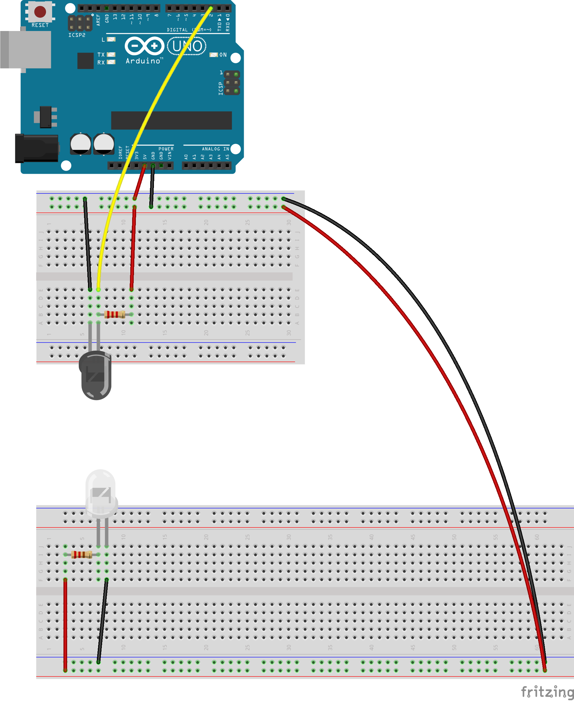
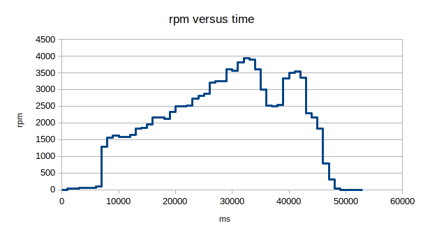

# project3

## Collin Reilly Clark
## 605.715

### Requirements

I am following the project requirements to capture the RPM of a propellor over
time using an IR emitter/detector pair in a round-robin with interrupts design.

### Design

I have a counter that is incremented by an interrupt handler `INT0`. `INT0` is
triggered by a falling edge on pin D2, which represents the IR beam breaking
and being resumed. The main loop periodically sleeps and then resets the
counter, calculating and printing the RPMs along with the number of elapsed
milliseconds since the beginning of execution.

### Diagram

\
\

### Code

```rust

#![no_std]
#![no_main]
#![feature(abi_avr_interrupt)]

extern crate panic_halt;
use arduino_uno::prelude::*;
use core::cell;

const SAMPLE_RATE_MS: u32 = 1000;
const SAMPLE_RATE_MULTIPLIER: u32 = 60000 / SAMPLE_RATE_MS / 2; // divide by number of propellers


static COUNTER: avr_device::interrupt::Mutex<cell::Cell<u32>> =
    avr_device::interrupt::Mutex::new(cell::Cell::new(0));

#[avr_device::interrupt(atmega328p)]
fn INT0() {
    // external interrupt 0 (falling edge triggered)
    avr_device::interrupt::free(|cs| {
        let counter = COUNTER.borrow(cs).get();
        COUNTER.borrow(cs).set(counter + 1);
    });
}

fn int0_init(exint: arduino_uno::pac::EXINT) {
    exint.eimsk.write(|w| w.int0().set_bit()); // enable int0
    exint.eicra.write(|w| w.isc0().val_0x02()); // falling edge interrupts
}

#[arduino_uno::entry]
fn main() -> ! {
    let dp = arduino_uno::Peripherals::take().unwrap();

    let mut pins = arduino_uno::Pins::new(dp.PORTB, dp.PORTC, dp.PORTD);
    let mut counter = 0;
    let mut time = 0;

    int0_init(dp.EXINT);

    let _interrupt = pins.d2.into_pull_up_input(&mut pins.ddr);
    let mut serial = arduino_uno::Serial::new(
        dp.USART0,
        pins.d0,
        pins.d1.into_output(&mut pins.ddr),
        57600.into_baudrate(),
    );

    ufmt::uwriteln!(&mut serial, "time, rpm\r").void_unwrap();
    unsafe { avr_device::interrupt::enable() };

    loop {
        avr_device::interrupt::free(|cs| {
            counter = COUNTER.borrow(cs).get();
            COUNTER.borrow(cs).set(0);
        });
        let rpm = counter * SAMPLE_RATE_MULTIPLIER;
        ufmt::uwriteln!(&mut serial, "{}, {} \r", time, rpm).void_unwrap();
        arduino_uno::delay_ms(SAMPLE_RATE_MS as u16);
        time += SAMPLE_RATE_MS;

    }
}
```

### Video

[https://youtu.be/D9fmB9kUxzI](https://youtu.be/D9fmB9kUxzI)
